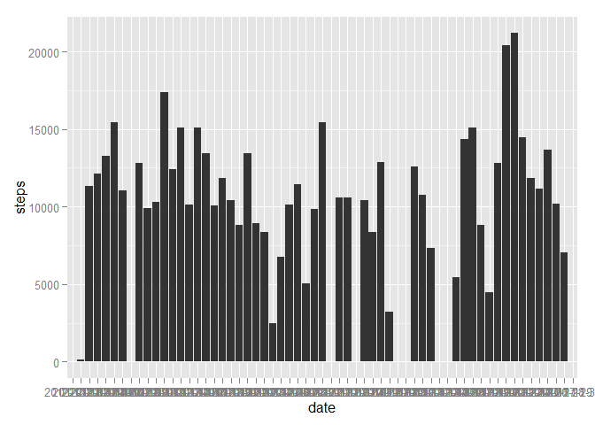
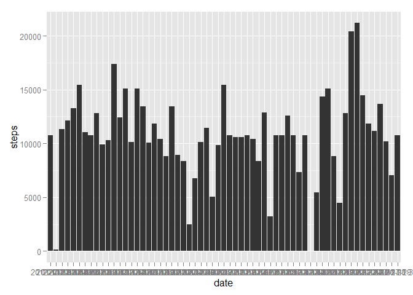

# Reproducible Research: Peer Assessment 1
rwong013  

#Activity Monitoring

## Loading and preprocessing the data

The data is loaded here into the **activity** data table


```r
library(dplyr)
```

```
## 
## Attaching package: 'dplyr'
## 
## The following objects are masked from 'package:stats':
## 
##     filter, lag
## 
## The following objects are masked from 'package:base':
## 
##     intersect, setdiff, setequal, union
```

```r
setwd("C:/Users/rwong/Documents/DSS/ReproducibleResearch/RepData_PeerAssessment1")
activity <- read.csv("C:/Users/rwong/Documents/DSS/ReproducibleResearch/RepData_PeerAssessment1/activity.csv")
```

## What is mean total number of steps taken per day?

First, we must sum the total number of steps per day. Then we will take the average and median total steps per day.

```r
library(ggplot2)
activitybyday <- activity %>% group_by(date) %>% summarize_each(funs(sum(., na.rm=TRUE)), steps)
meansteps <- mean(activitybyday$steps, na.rm=TRUE)
mediansteps <- median(activitybyday$steps, na.rm=TRUE)
qplot(data=activitybyday, date, steps, geom = "histogram", stat = "identity")
```

 

The mean total number of steps taken each day is 9354.2295082. 
The median number of steps taken each day is 10395.

## What is the average daily activity pattern?

Using the ggplot2 library, we will plot the average of steps taken at each 5-minute interval in the day.


```r
activitybyinterval <- activity %>% group_by(interval) %>% summarize_each(funs(mean(., na.rm = TRUE)), steps)
qplot(data = activitybyinterval, interval, steps, geom = "line")
```

 

```r
maxinterval <- activitybyinterval[activitybyinterval$steps == max(activitybyinterval$steps),]
```

On average, the most active 5-minute interval is 835 with 206.1698113 steps.


## Imputing missing values


```r
missingsteps <- sum(is.na(activity$steps))
```

The intervals with missing data is 2304. We will fill in that missing data by filling NA values with the overall average for that interval.


```r
meanactivitybyday <- activity %>% group_by(date) %>% summarize_each(funs(sum(., na.rm=TRUE)), steps)
activityfill <- activity

for(i in 1:nrow(activityfill)){
        if(is.na(activityfill$steps[i])){
                activityfill$steps[i] <- activitybyinterval$steps[activitybyinterval$interval == activityfill$interval[i]]
        }
}
```

The effect that filling this data in is as follows:

```r
activityfillbyday <- activityfill %>% group_by(date) %>% summarize_each(funs(sum), steps)
meanstepsfill <- mean(activityfillbyday$steps)
medianstepsfill <- median(activityfillbyday$steps)
qplot(data=activityfillbyday, date, steps, geom = "histogram", stat = "identity")
```

 

Using the filled in data, the mean total number of steps taken each day is 1.0766189\times 10^{4} whereas previously it was 9354.2295082.
Using the filled in data, the median number of steps taken each day is 1.0766189\times 10^{4} whereas previously it was 10395.

## Are there differences in activity patterns between weekdays and weekends?
